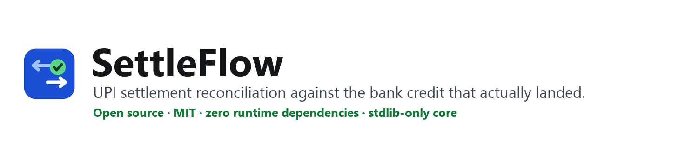
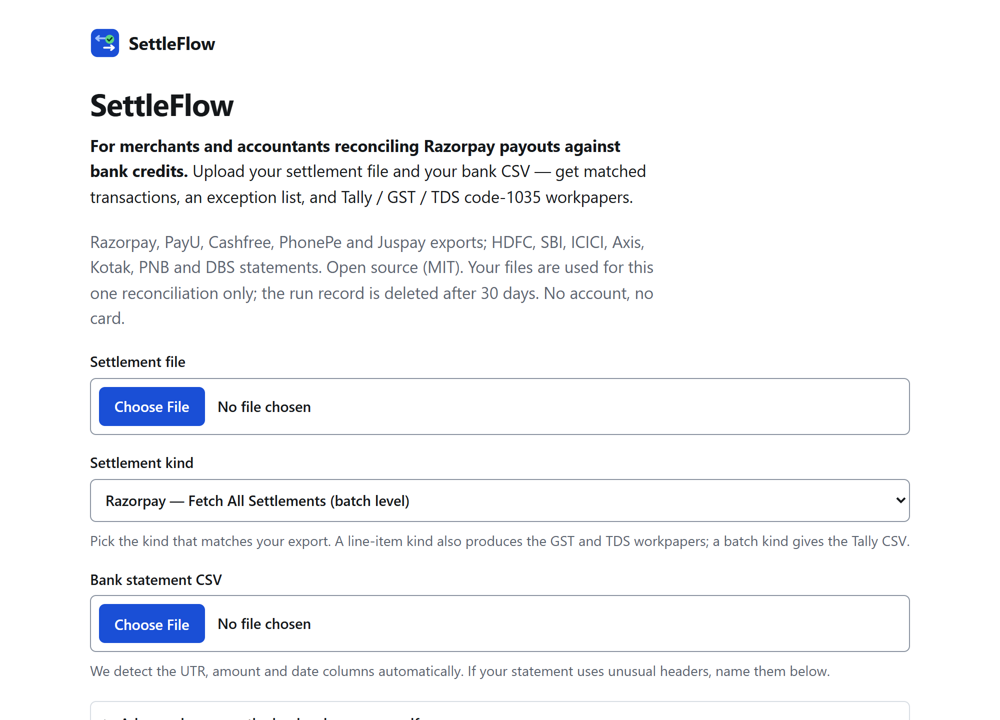
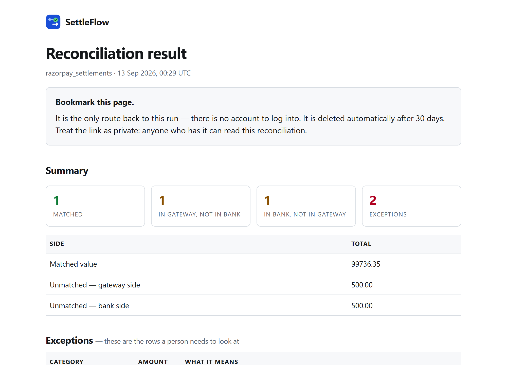

<p align="center">
  
</p>

<p align="center">
  <a href="https://settleflow.atlasnex.com">Live demo (free)</a> ·
  <a href="docs/USER-GUIDE.md">User guide</a> ·
  <a href="CHANGELOG.md">Changelog</a> ·
  <a href="CONTRIBUTING.md">Contributing</a> ·
  <a href="SECURITY.md">Security</a>
</p>

<p align="center">
  
  <a href="LICENSE"></a>
  
  
  
  <a href="https://pypi.org/project/settleflow/"></a>
</p>

**For merchants and accountants reconciling UPI payouts against bank credits.**
A gateway settlement file and a bank statement go in; matched rows, an explicit
exception list, and Tally / GST / TDS code-1035 (ex-194O) workpapers come out.
Open source (MIT), Python, **zero runtime dependencies** — the core runs on the
standard library alone, enforced by CI.

**Why not just use the gateway's own settlement reports?** They tell you what the
gateway *says* it sent. They never check against the credit that actually landed in
your **bank**, and they don't produce workpapers. UPI settles as bulk NEFT credits:
one undifferentiated bank line against hundreds of orders. The match key is **not**
the UTR — your bank's UTR is the correspondent bank's, a different number. SettleFlow
closes that gap deterministically, and every match is inspectable.

<p align="center">
  
  
</p>

## Install

```bash
pip install settleflow
```

That's it — published on PyPI, and the core needs no dependencies at all.
(Optional extras: `[saas]`, `[pdf]`, `[ocr]`.) Python ≥ 3.10 (CI runs 3.10–3.12).

## 60-second tour

```bash
# the library — one command, three workpapers in out/
python -m settleflow reconcile \
    --settlements settlements.csv --vendor razorpay_settlement_csv \
    --bank sbi --statement statement.csv --out-dir out

# the hosted app locally (needs: pip install "settleflow[saas]")
python -m uvicorn saas.app:app --port 8093
# open http://127.0.0.1:8093 — or the live demo at settleflow.atlasnex.com

# the single runnable self-check (no test framework, by design)
python tests/test_matching.py        # prints "all 77 checks passed"
```

## 10-second example

```python
from datetime import date
from decimal import Decimal
from settleflow import Txn, match

settlements = [Txn("123456789012", Decimal("100.00"), date(2026, 8, 15))]
bank        = [Txn("1234 5678 9012", Decimal("100.00"), date(2026, 8, 16))]

result = match(settlements, bank)
print(result.matched)           # one exact match — UTRs normalized, money is Decimal
print(result.settlement_only)   # in the gateway file, not in your bank
print(result.bank_only)         # in your bank, not in the gateway file
```

## What it reads

| Side | Formats |
|---|---|
| **Settlements** | Razorpay (Fetch-All-Settlements JSON, Settlement Recon JSON, both CSV exports), PayU (`/settlement/range`, `/settlement/transactionDetails`), Cashfree (Settlement Recon report, incl. its two-section CSV), PhonePe settlement report, Juspay settlement file |
| **Bank statements** | HDFC, SBI, ICICI, Axis, Kotak (3 variants), PNB, DBS — CSV/flattened text; **SBI PDFs** natively (YONO / netbanking / credit-card layouts) and scanned PDFs via OCR (`[pdf]` / `[ocr]` extras) |
| **You get** | matched ledger, exception list (fee drift, stale settlements, duplicates, direct transfers), Tally bank-receipt CSV, GST netting worksheet, TDS code-1035 worksheet |

A format with no verified public sample is **refused, never guessed** — that is why
IDFC and Cashfree's plain settlements export stay unwired (guessing a column layout
is how silently wrong ledgers get made). [docs/SCHEMAS.md](docs/SCHEMAS.md) traces
every wired format to its source.

## Library API

```python
from settleflow import parse_razorpay_recon, group_batches, match_orders

lines = parse_razorpay_recon(api_response_dict)   # GET /v1/settlements/recon/combined
batches = group_batches(lines)                    # netting: gross − MDR − GST − refunds
orders = [Txn(None, Decimal("1000.00"), date(2026, 8, 15), ref="order_123")]
result = match_orders(lines, orders)              # payments joined to your order ledger
```

Exports: `export_tally_csv`, `export_gst_worksheet`, `export_tds_1035`. Exceptions:
rule-based `classify`, a `build_llm_prompt` helper, a provider-agnostic
`triage_exceptions` hook. Full API: [`docs/ARCHITECTURE.md`](docs/ARCHITECTURE.md).

## Optional extras

The core is stdlib-only — these are opt-in and lazily imported:

| Extra | Gives you | Pulls in |
|---|---|---|
| `pip install "settleflow[saas]"` | the thin FastAPI web layer (`saas/`) | fastapi, uvicorn, jinja2, python-multipart |
| `pip install "settleflow[pdf]"` | native SBI PDF statements | pymupdf |
| `pip install "settleflow[ocr]"` | scanned (image-only) PDF statements | pymupdf + system Tesseract |

## Security posture (honest)

- Core library: stdlib only, **no network calls of any kind** — local file in, local file out.
- The hosted service: run URLs are bearer credentials (no-store everywhere, including
  the CDN), uploads size-capped **and** work-capped, rate limits keyed so a caller
  cannot mint identity per request, malformed input refused as 400 — never 500,
  never a crash.
- The first real Strix AI pentest ran on this repo (v0.7.4); all 12 findings
  (1 high, 5 medium) are fixed in 0.7.5 with live-gate evidence per fix — see
  [CHANGELOG.md](CHANGELOG.md) and [docs/DECISIONS.md](docs/DECISIONS.md) D-38…D-42.
- Found something? [SECURITY.md](SECURITY.md) — email, not a public issue.

## Status — what works, what doesn't

**Built:** the table above, a CLI, exception classification, the hosted beta
(`saas/`, deployable via Docker or plain systemd+Cloudflare-Tunnel), CI on three
Python versions plus a boot-and-reconcile integration job, 77 assert-based checks.

**Not built — don't pretend otherwise:** non-SBI bank PDFs, a user model or API keys
(the service is deliberately stateless per run), and any SLA. Pre-1.0: no API-stability
promise. Legal pages in [docs/legal/](docs/legal/) are drafts pending professional review.

## Pricing, honestly

- Library: MIT, free forever. Self-hosting: free.
- Hosted service: **free while in beta**. No commercial tier is live; if that changes
  it will be announced here and on [the site](https://settleflow.atlasnex.com/pricing).

## Docs

| File | What |
|---|---|
| [docs/USER-GUIDE.md](docs/USER-GUIDE.md) | walkthrough: first reconciliation → workpapers |
| [docs/ARCHITECTURE.md](docs/ARCHITECTURE.md) | system map: files, data model, algorithm |
| [docs/FLOW.md](docs/FLOW.md) | an exact end-to-end trace of a match |
| [docs/SCHEMAS.md](docs/SCHEMAS.md) | verified vendor/bank layouts + sources |
| [docs/CONSTRAINTS.md](docs/CONSTRAINTS.md) | never-touch rules (Decimal, determinism, zero deps) |
| [docs/TESTING.md](docs/TESTING.md) / [docs/DECISIONS.md](docs/DECISIONS.md) | checklist; the why behind choices |
| [docs/UI-AUDIT.md](docs/UI-AUDIT.md) | the WCAG sweep: pairs, ratios, fix list |
| [docs/BUG.md](docs/BUG.md) / [docs/FEATURE.md](docs/FEATURE.md) | bug and feature trails |
| [MASTER-PLAN.md](MASTER-PLAN.md) / [docs/MONETIZATION.md](docs/MONETIZATION.md) | strategy and the commercial thesis |

## License

MIT — see [LICENSE](LICENSE). The one asymmetry that matters: you can audit exactly
how your reconciliation is computed, which no closed reconciliation SaaS will let
you do.

Built by [AtlasNex](https://atlasnex.com) · sanjay@atlasnex.com
